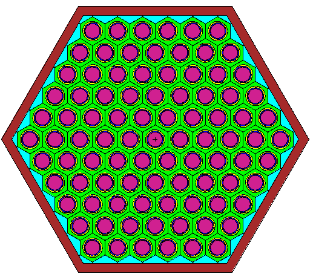

# FRIDGe Example

## Single Assembly

An few example fuel assemblies can be seen in \verb|fridge/data/assembly|. 
This example will look at the \verb|EBRII_MKII| assembly. 
This assembly has the following attributes, which can be seen in Table \ref{tab:ebrii}.

Table 1. Variables for Fuel Assembly YAML file.

|Variable Name   | EBRII MKII Assembly |
|----------------|---------------|
|Assembly Type  | Fuel |
|Assembly Pitch | 5.887 |
|Duct Thickness | 0.2032 |
|Duct Inside Flat to Flat | 5.6134 |
|Assembly Height | 164.386 |
|Coolant | LiquidNa |
|Assembly Material | SS316|
|Pins Per Assembly | 91 |
|Pin Diameter | 0.4420 |
|Clad Thickness | 0.0305|
|Fuel Diameter | 0.3302|
|Pitch | 0.566|
|Wire Wrap Diameter | 0.124|
|Wire Wrap Axial Pitch | 15.24 |
|Fuel Height | 34.29 |
|Fuel | U|
|Clad | SS316 |
|Bond | LiquidNa |
|Bond Above Fuel | 1.31 |
|Plenum Height | 28.3|
|Plenum Smear | {LiquidNa: 0.50, Void: 0.25, SS316: 0.25} |
|Reflector Height | 61.3537 |
|Reflector Smear | {LiquidNa: 0.116, 0.884} |

The inputs from Table 1 create an assembly similar to the MK-II driver assemblies found in EBRII, as referenced in \cite{ebrii}, where Figures \ref{fig: fullAssem} - \ref{fig: fuelRegion} show the MCNP assembly.
In Figure \ref{fig: fullAssem} the regions are, from bottom to top; lower reflector, fuel, plenum and upper reflector.
In \ref{fig: upperFuel}, we see the impact of including the variable \verb|Bond Above Fuel|, which adds the bond material (blue) above the fuel (purple).
Figure \ref{fig: fuelRegion} shows the 91 pins in the assembly; there is fuel (purple), bond (blue), clad (yellow), wire wrap + coolant mixture (green), excess coolant (light blue), and the hex duct (maroon).

 

## Full Core

