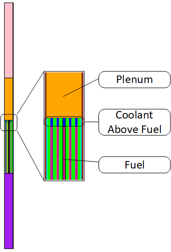
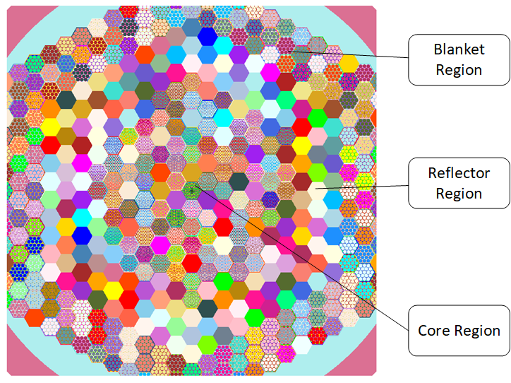

# FRIDGe Example

## Single Assembly

An few example fuel assemblies can be seen in `fridge/data/assembly`.
This example will look at the `EBRII_MKII` assembly.
This assembly has the following attributes, which can be seen in Table 1.

Table 1. Variables for Fuel Assembly YAML file.

|Variable Name   | EBRII MKII Assembly |
|----------------|---------------|
|Assembly Type  | Fuel |
|Assembly Pitch | 5.887 |
|Duct Thickness | 0.2032 |
|Duct Inside Flat to Flat | 5.6134 |
|Assembly Height | 164.386 |
|Coolant | LiquidNa |
|Assembly Material | SS316|
|Pins Per Assembly | 91 |
|Pin Diameter | 0.4420 |
|Clad Thickness | 0.0305|
|Fuel Diameter | 0.3302|
|Pitch | 0.566|
|Wire Wrap Diameter | 0.124|
|Wire Wrap Axial Pitch | 15.24 |
|Fuel Height | 34.29 |
|Fuel | U|
|Clad | SS316 |
|Bond | LiquidNa |
|Bond Above Fuel | 1.31 |
|Plenum Height | 28.3|
|Plenum Smear | {LiquidNa: 0.50, Void: 0.25, SS316: 0.25} |
|Reflector Height | 61.3537 |
|Reflector Smear | {LiquidNa: 0.116, 0.884} |

The inputs from Table 1 create an assembly similar to the MK-II driver assemblies found in EBRII, as referenced in [1], where Figure 1 and Figure 2 show the MCNP assembly.
In Figure 1 the regions are, from bottom to top; lower reflector, fuel, plenum and upper reflector.
Along with this, a blown up section of the fuel shows how the variable `Bond Above Fuel` adds addition bond above the fuel.
Figure 2 shows the 91 pins in the assembly; there is fuel (purple), bond (blue), clad (yellow), wire wrap + coolant mixture (green), excess coolant (light blue), and the hex duct (maroon).

Figure 1. EBR-II MKII assembly.

Figure 2. Plan view of EBR-II fuel section.

## Full Core

Utilizing the EBR-II MKII assembly from above and creating reflector and blanket assemblies, a simplified full core model of EBR-II was created.
This model only has three types of assemblies, driver, reflector, and blanket assemblies, but it provides a proof of concept for building full core models with varying assemblies.
Figure 3 shows the EBR-II full core model, where it should be noted that not all of the blanket assemblies were added to reduce the size of the figure and input file.
The input files for the core and assemblies can be seen in `data/core` and `data/assembly`, respectively.

Figure 3. Simplified EBR-II Core.

[1] E. Lum, C. Pope, R. Stewart, B. Byambadorj, Q. Beaulieu, “Evaluation of Run 138B at Experimental Breeder Reactor II”, EBR2-LMFR-RESR-001-CRIT, International Handbook of Evaluated Reactor Physics Benchmark Experiments, 2018.