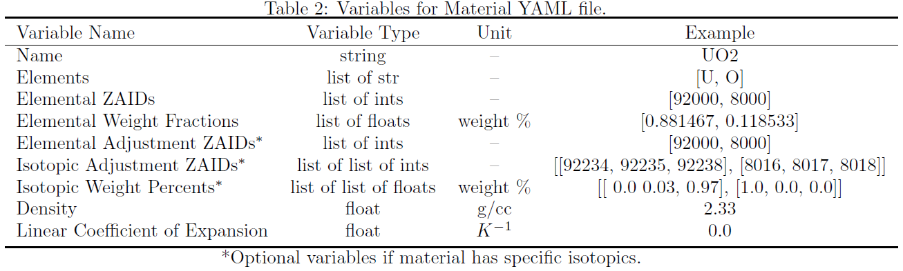

# Materials

Materials can be found in the directory `fridge/data/materials`.
Each material in a problem requires its own YAML file and contains five mandatory variables and three optional variables.
Where each variable and its associate input can be seen in Table 2.

`Name` is a string containing the name of the element. 
`Elements` is a list of element symbols to be used in the material. 
Note: This element symbol is how FRIDGe finds the element in `fridge/data/CotN`, so ensure that the elements exists there and the symbol matches.
`ZAIDs` is list of an integers, where each ZAID is denoted by 1000 * Z (proton or atomic number). 
`Weight Fractions` is a list of floats whose entries are the weight fractions associated with the `ZAIDs` above. 
Note: This value should sum to 1.0. `Enrichment ZAIDs` is a list of ZAIDs whose isotopic fraction is different from the base element. 
Note: If the isotopic composition is the same as the element in question, the element does not need to be included and it will be created as normal. 
`Enrightment Isotopes` is a list of lists of isotopic ZAIDs, where each list corresponds to the the the `Enrichment ZAIDs` from above. 
`Enrichment Vector` is a list of lists of weight fractions (enrichment) of each isotope from `Enrichment Vector`. 
Note: Each list should sum 1.0.
`Density` is the density of the natural isotope in g/cc.
`Linear Coefficient of Expansion` is the coefficient of thermal expansion.
