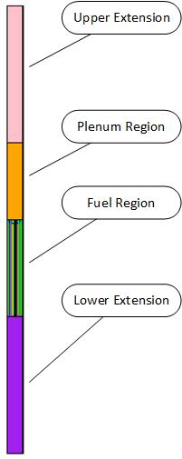
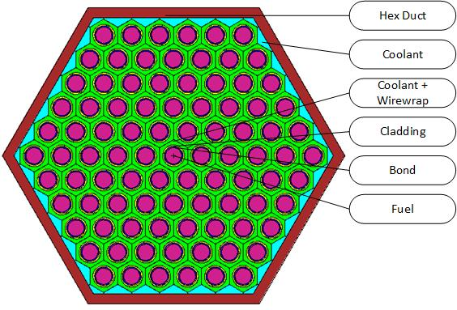

# Summary

Nuclear power currently produces the largest amount of carbon-free energy in the world.
Despite this, there is often hesitation to utilizing nuclear energy due to significant accidents such as Three Mile Island and Fukushima.
During the early 2000's the concept of Generation IV (Gen IV) reactors arose to tackle many of the systemically negative perceptions surrounding nuclear power.
Gen IV reactors are designs which epitomize safety, proliferation resistance, and sustainable fuel usage [@GenIV].
There are currently six different Gen IV reactors selected for research and development; two of these designs are are liquid metal fast reactors (LMFR).
LMFRs utilize liquid metal as the primary coolant (typically sodium, lead, or lead-bismuth) and rely on fast neutrons to drive the chain reaction.
Often times this is advantageous for reactors to breed fuel for a closed fuel cycle, or burn spent fuel from light water reactors.
LMFRs have been built in reduced scales in the past to determine operating characteristics and provide experimental data for reactor safety in accident scenarios.
In the past, reactor designers relied on hand calculations and experimental facilities to build full scale reactor cores.
Due to the cost of building new experimental facilities and an increase in computational power, simulations are heavily relied on to support the reactor design process.

Reactor core design for nuclear engineers is an extremely complex topic which requires skills in multiple areas of study such as neutronics, thermal hydraulics, and materials performance.
The first step in core design typically starts with examining the neutronic viability.
This process involves finding appropriate materials, geometries, and core configurations which will achieve a critical configuration.
Software models are used to test the various configurations to determine their applicability to the design problem.
The software to perform such complex calculations is often sophisticated and requires detailed user knowledge to create accurate models.
Utilizing software alleviates solving the fundamental physics associated with core design, but comes at the cost of learning the nuances of software suites.

MCNP is a commonly used neutron transport code for radiation shielding, criticality measurements, benchmark measurements, and reactor core design [@Goo2012].
The code suite is extremely versatile and allows the user to incorporate multiple physical phenomena, given the user's ability to navigate it.
MCNP builds models in a traditional text-based input file, which includes building surfaces, materials, and defining what materials are present inside each surface.
Building simple geometries is a relatively straight forward process, whereas more complex configurations, such as a LMFR assembly or core, requires additional finesse.
This requires the designer to shift their focus from design to input file management, which takes away from their ability to critically think about the core.
Building input files for MCNP for large systems by hand is both time consuming and error prone.
This is exemplified when trying to model a heterogeneous core where the input deck can grow exceedingly large (over 10,000 lines).
At this size, it is unrealistic to perform any type of design iteration by manually adjusting design parameters and expecting a functioning model free of errors.

While others have contriubted to reducing the learning curve of MCNP, most of them focus on pre/post-processing tasks associated with MCNP.
For example, PyNE [@Scopatz2012b] and the MCNPTools Package [@Solomon2017] help users streamline common tasks like scraping MCNP output files.
While these help users manage data associated with MCNP, a code suite which focuses on reactor design provides a resource for initial model creation.
FRIDGe was created to help alleviate the process of learning additional code nomenclature when designing, modeling, and testing fast reactor concepts.
The only inputs the user focuses on are directly related to the core design process and create a level of abstraction from the input deck generation.
This allows the user to focus on what aspects of the design affect the reactor, rather than input file creation and management.

FRIDGe currently houses the capability to create input files, for a single assembly or full core, for the MCNP.
This process is done by creating a series of YAML data files for elements, materials, assemblies, and cores [@YAML].
The element file allows the user to create elements from the Chart of the Nuclides for use in materials.
The material file allows the user to create custom materials (fuel, cladding, coolant, poisons, etc.) that the model will require.
The assembly file is used for individual assemblies, where the user can specify the assembly type, geometry, and materials used.
Currently a user can build fuel or smear assemblies.
Fuel assemblies encompass two reflector regions, a plenum region, and a spatially heterogeneous fuel region which can describe driver or blanket fuel assemblies.
Blank assemblies are a single region, where the user can specify a smear material to describe an assembly type (i.e. reflectors, coolant assemblies).
The core file is used to determine the assemblies present, their position within the core, and general core data such as the coolant type, and vessel material.
The culmination of these data files allows the user to create a single FRIDGe input file.
The input file has general setting for the reactor model and any additional features to be applied to the model.
For example, the user can define the temperature and cross-section set used, which can quantify the impact of Doppler Broadening or cross-section set sensitivity.
Along with this, the coolant in the core can be voided to simulate a loss of coolant accident to determine the void coefficient.
Once the model has been created, the user can take the input file and run MCNP to gather the appropriate reactor physics.

# Full Assembly Example

To illustrate the versatility of FRIDGe, it was used to create a simplified driver assembly from the Experimental Breeder Reactor II (EBR-II).
All of the dimensions were taken from the International Handbook of Evaluated Reactor Physics benchmark evaluation of EBR-II [@Lum2018].
The two figures below show an axial and plane view of the assembly, which describes each region of the assembly.

 

The assembly built by FRIDGe closely resembles the typical driver assembly built in the benchmark evaluation.
There are slight differences in design preference, for example, the benchmark explicitly models the wire wrap and plenum, whereas FRIDGe homogenizes these regions.
FRIDGe was built as a tool for LMFR core designers who need the ability to model an assembly or full core with relative ease. 
Where this toodl will allow allows a core designer to rapidly build, run, and iterate on a reactor design without being bogged down by input deck generation.

# References
